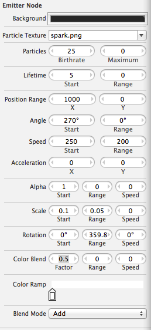

# Sprite Kit Speed Run Speaker Notes

* (These notes are designed to be used with Jonathan Penn's excellent [KeyGrip](https://github.com/rubbercitywizards/KeyGrip) utility.)

## Create New Project, Strip Template Code

* In Xcode, select New -> Project -> SpriteKit Game
* Run it to show what it does
* In MyScene.m, remove code under initWithSize: and *touchesBegan:*

## Create Star Field

* Choose New -> File -> SpriteKit Particle File
* Use Spark template, name it StarField. Pull up Emitter editor.
* Discuss emitters. Mention that they have lots of properties, many (but not all) of which can be set in Xcode.
* Work through properties settings:

* In **myScene.m** *initWithSize*, add this:

---

    [self setupStarfield];

Then add implementation:

	-(void)setupStarfield {
        NSString *starfieldPath = [[NSBundle mainBundle] pathForResource:@"StarField" ofType:@"sks"];
        SKEmitterNode *starfieldNode = [NSKeyedUnarchiver unarchiveObjectWithFile:starfieldPath];
        starfieldNode.position = CGPointMake( CGRectGetMidX(self.frame), CGRectGetHeight(self.frame));
    
        starfieldNode.particleColorSequence = nil;
        starfieldNode.particleColor = [SKColor redColor];
        starfieldNode.particleColorBlueRange = 255.0;
        starfieldNode.particleColorGreenRange = 255.0;
    
        [self addChild:starfieldNode];
    }

## Add Ship

Ok, now we need a spaceship for you to fly! First off, let's create a new Asset Catalog. (SpriteTextures)

Now drag the spaceship image in from our assets folder.

Finally, let's add some code. Our scene needs a property to keep track of the ship node:

    @interface MMMyScene ()
    
    @property (strong) SKSpriteNode *shipNode;
    
    @end

Then we add some code to add the ship node to the scene:

	-(void)setupShipNode {
		SKSpriteNode *shipNode = [SKSpriteNode spriteNodeWithImageNamed:@"ship.png"];
		shipNode.position = CGPointMake( CGRectGetMidX(self.frame), 50);
		shipNode.size = CGSizeMake( CGRectGetWidth(shipNode.frame) * 2, CGRectGetWidth( shipNode.frame) * 2);
	
		[self addChild:shipNode];
		self.shipNode = shipNode;
	}

And finally, we call the new method in the init:

    		[self setupShipNode];

## Add Score

A space shooter isn't much fun if you don't get points! Let's add a property to keep track of our score node:

	@property (strong) SKLabelNode *scoreNode;

Let's add a node for displaying a 1UP label and our score:

	-(void)setupScoreNode {
		SKLabelNode *oneUpNode = [SKLabelNode labelNodeWithFontNamed:@"Futura-CondensedExtraBold"];
		oneUpNode.fontColor = [SKColor whiteColor];
		oneUpNode.position = CGPointMake( 50, CGRectGetMaxY(self.frame) - 50);
		oneUpNode.text = @"1UP";
	
		SKLabelNode *scoreNode = [SKLabelNode labelNodeWithFontNamed:@"Futura-CondensedExtraBold"];
		scoreNode.fontColor = [SKColor redColor];
		scoreNode.position = CGPointMake( 50, CGRectGetMaxY(self.frame) - 100 );
		scoreNode.text = @"0";
	
		[self addChild:oneUpNode];
		[self addChild:scoreNode];
		self.scoreNode = scoreNode;
	}

And finally, we call it:

    		[self setupScoreNode];

